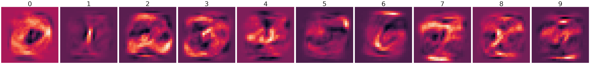
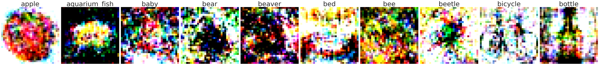
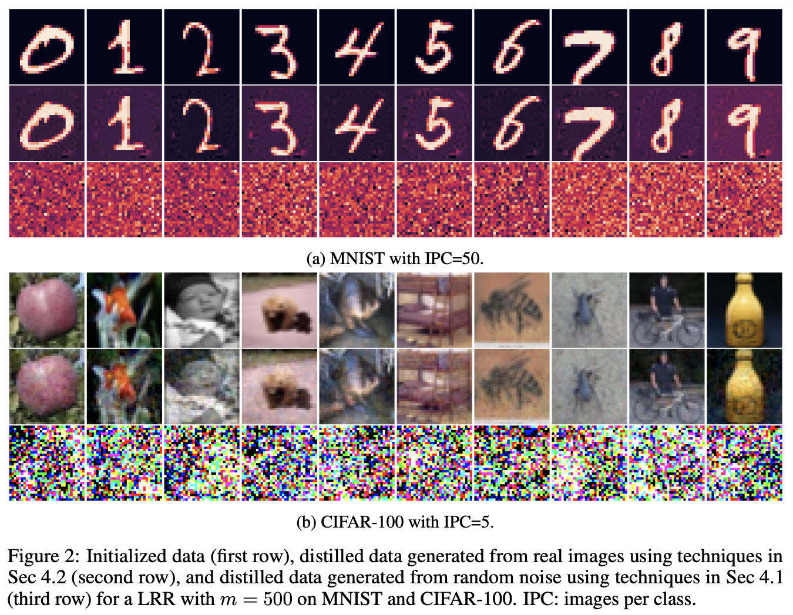

# Provable and Efficient Dataset Distillation for Kernel Ridge Regression
This is the official repository for the paper ["Provable and Efficient Dataset Distillation for Kernel Ridge Regression"](https://openreview.net/pdf?id=WI2VpcBdnd), NeurIPS 2024.

Deep learning models are now trained on increasingly larger datasets, making it
crucial to reduce computational costs and improve data quality. Dataset distillation
aims to distill a large dataset into a small synthesized dataset such that models
trained on it can achieve similar performance to those trained on the original
dataset. While there have been many empirical efforts to improve dataset distillation
algorithms, a thorough theoretical analysis and provable, efficient algorithms are
still lacking. In this paper, by focusing on dataset distillation for kernel ridge
regression (KRR), we show that one data point per class is already necessary and
sufficient to recover the original model’s performance in many settings. For linear
ridge regression and KRR with surjective feature mappings, we provide necessary
and sufficient conditions for the distilled dataset to recover the original model’s
parameters. For KRR with injective feature mappings of deep neural networks, we
show that while one data point per class is not sufficient in general, k+1 data points
can be sufficient for deep linear neural networks, where k is the number of classes.
Our theoretical results enable directly constructing analytical solutions for distilled
datasets, resulting in a provable and efficient dataset distillation algorithm for KRR.
We verify our theory experimentally and show that our algorithm outperforms
previous work such as KIP while being significantly more efficient, e.g. 15840×
faster on CIFAR-100.

# Setup
This code has been tested on the below environments:
```
python==3.9.20
pytorch==2.5.1
```
Required packages can be installed using `Conda` as follows,
```
conda env create -f environment.yml
conda activate data_distill
```


# Experiments

- For different datasets, set `dataset` in `config/distill.yaml` as one of the `[MNIST, CIFAR10, CIFAR100].`
- For different images per class (IPC), set `IPC` in `config/distill.yaml` as any integer `>=1`. Recommend to choose from `[1, 10, 50]`.
- For different models, set `kernel` in `config/distill.yaml` as one of the `[identity, FCNN, random_fourier].`
#### (I) Generate distilled data for one data per class

Set `IPC=1` and `kernel=identity`, run

```
python distill.py --config config/distill.yaml
```

For MNIST, 

 
For CIFAR-100,



#### (II) Generate distilled data that is close to original images or from random noise  
To generate distilled data that is close to sampled original images, 
set `IPC=10` or `IPC=50` and `kernel=identity`.
Set `generate_from_real_data=True`,

```
python distill.py --config config/distill.yaml
```

To generate distilled data from random noise, 
set `generate_from_real_data=False`


For MNIST with IPC=50 and CIFAR-100 with IPC=5,


#### (III) Compare with KIP.
To run KIP experiments,
```
python distill_kip.py
```


# Cite this work
```
@inproceedings{
chen2024provable,
title={Provable and Efficient Dataset Distillation for Kernel Ridge Regression},
author={Yilan Chen and Wei Huang and Tsui-Wei Weng},
booktitle={The Thirty-eighth Annual Conference on Neural Information Processing Systems},
year={2024},
url={https://openreview.net/forum?id=WI2VpcBdnd}
}
```